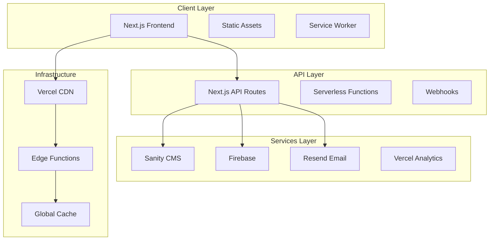
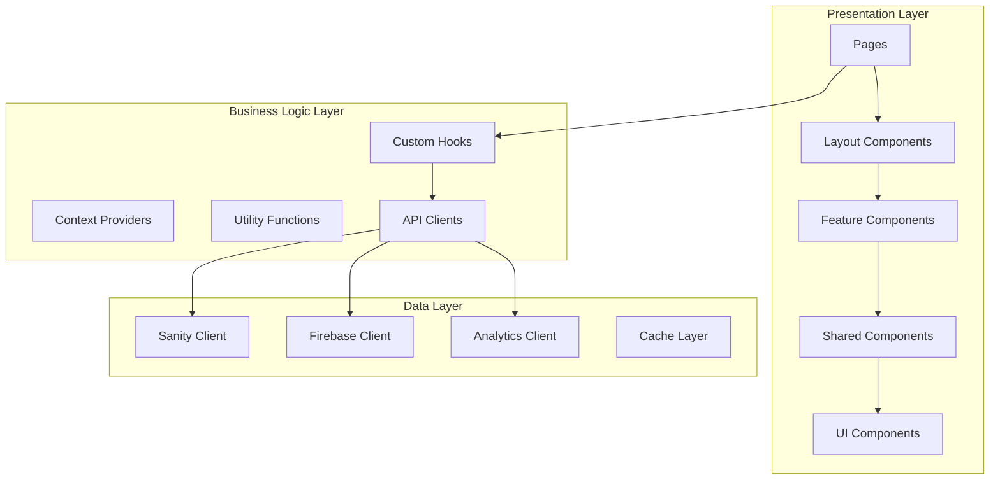
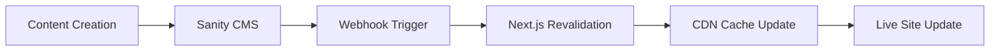
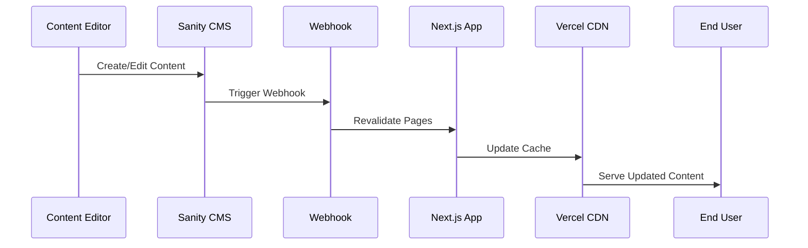
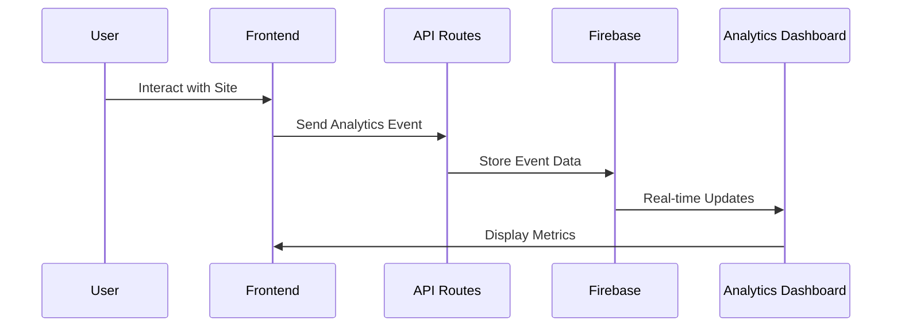
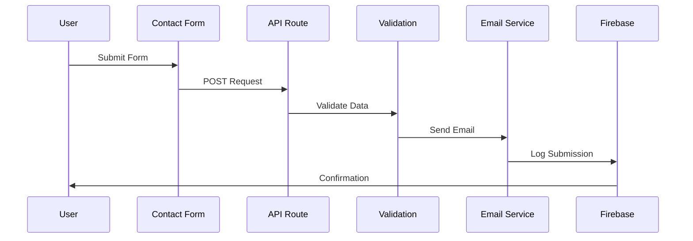
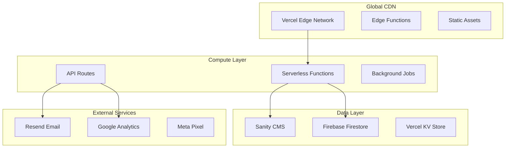
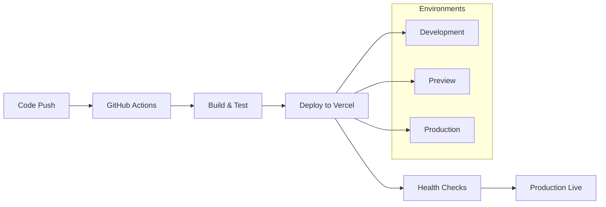

# System Architecture

## Table of Contents

- [Overview](#overview)
- [Architecture Patterns](#architecture-patterns)
- [Technology Stack](#technology-stack)
- [System Components](#system-components)
- [Data Flow](#data-flow)
- [Security Architecture](#security-architecture)
- [Performance Architecture](#performance-architecture)
- [Deployment Architecture](#deployment-architecture)

## Overview

The Aviators Training Centre platform is built as a modern, scalable web application using a **JAMstack architecture** with **headless CMS** and **serverless functions**. The system is designed for high performance, security, and maintainability.

### Core Architectural Principles

1. **Separation of Concerns**: Clear separation between presentation, business logic, and data layers
2. **Scalability**: Horizontal scaling through serverless architecture
3. **Performance**: Optimized for Core Web Vitals and fast loading times
4. **Security**: Defense in depth with multiple security layers
5. **Maintainability**: Modular design with clear interfaces and documentation

## Architecture Patterns

### JAMstack Architecture



### Component Architecture



## Technology Stack

### Frontend Stack

| Technology | Version | Purpose |
|------------|---------|---------|
| **Next.js** | 15.3.1 | React framework with SSR/SSG |
| **React** | 18.3.1 | UI library |
| **TypeScript** | 5.5.3 | Type safety |
| **Tailwind CSS** | 3.4.11 | Styling framework |
| **Framer Motion** | 12.7.3 | Animations |

### Backend Services

| Service | Purpose | Integration |
|---------|---------|-------------|
| **Sanity CMS** | Content management | Headless CMS with real-time updates |
| **Firebase** | Analytics & Auth | Firestore database, Authentication |
| **Resend** | Email service | Transactional emails |
| **Vercel** | Hosting & CDN | Serverless deployment |

### Development Tools

| Tool | Purpose |
|------|---------|
| **ESLint** | Code linting |
| **Jest** | Unit testing |
| **Playwright** | E2E testing |
| **TypeScript** | Static type checking |

## System Components

### Frontend Components

#### 1. Next.js Application
- **App Router**: File-based routing with layouts
- **Server Components**: Server-side rendering for performance
- **Client Components**: Interactive UI components
- **API Routes**: Serverless API endpoints

#### 2. Content Management
- **Sanity Studio**: Headless CMS for content editing
- **Real-time Preview**: Live preview of content changes
- **Content Validation**: Schema-based content validation
- **Asset Management**: Optimized image and media handling

#### 3. Analytics System
- **Custom Analytics**: Real-time user behavior tracking
- **Performance Monitoring**: Core Web Vitals tracking
- **Conversion Tracking**: Form submissions and user journeys
- **Error Tracking**: Automated error detection and reporting

### Backend Services

#### 1. API Layer
```typescript
// API Route Structure
/api
├── /analytics          # Analytics endpoints
├── /sanity            # CMS operations
├── /webhooks          # External integrations
├── /monitoring        # Health checks
└── /preview           # Content preview
```

#### 2. Authentication System
- **Admin Authentication**: JWT-based session management
- **Rate Limiting**: Protection against brute force attacks
- **Session Management**: Secure session handling
- **Permission Control**: Role-based access control

#### 3. Content Pipeline


## Data Flow

### Content Management Flow



### Analytics Data Flow



### Form Submission Flow



## Security Architecture

### Security Layers

1. **Network Security**
   - HTTPS enforcement
   - CORS configuration
   - Rate limiting
   - DDoS protection (Vercel)

2. **Application Security**
   - Input validation
   - XSS prevention
   - CSRF protection
   - SQL injection prevention

3. **Authentication Security**
   - JWT tokens
   - Secure session management
   - Password hashing
   - Multi-factor authentication (planned)

4. **Data Security**
   - Environment variable protection
   - API key management
   - Data encryption in transit
   - Secure data storage

### Security Implementation

```typescript
// Example: API Route Security
export async function POST(request: NextRequest) {
  // 1. Rate limiting
  await rateLimit(request);
  
  // 2. Authentication
  const session = await validateSession(request);
  
  // 3. Input validation
  const validatedData = await validateInput(request);
  
  // 4. Authorization
  if (!hasPermission(session, 'write')) {
    return unauthorized();
  }
  
  // 5. Process request
  return processRequest(validatedData);
}
```

## Performance Architecture

### Performance Strategies

1. **Static Generation (SSG)**
   - Pre-built pages at build time
   - Incremental Static Regeneration (ISR)
   - Edge caching

2. **Server-Side Rendering (SSR)**
   - Dynamic content rendering
   - Streaming responses
   - Selective hydration

3. **Client-Side Optimization**
   - Code splitting
   - Lazy loading
   - Image optimization
   - Bundle optimization

4. **Caching Strategy**
   ```mermaid
   graph TD
       A[User Request] --> B{Cache Check}
       B -->|Hit| C[Serve from Cache]
       B -->|Miss| D[Generate Content]
       D --> E[Update Cache]
       E --> F[Serve to User]
       
       subgraph "Cache Layers"
           G[Browser Cache]
           H[CDN Cache]
           I[Server Cache]
           J[Database Cache]
       end
   ```

### Performance Metrics

- **Core Web Vitals**: LCP < 2.5s, FID < 100ms, CLS < 0.1
- **Time to First Byte**: < 200ms
- **First Contentful Paint**: < 1.8s
- **Bundle Size**: < 250KB initial load

## Deployment Architecture

### Infrastructure Overview



### Deployment Pipeline



### Environment Configuration

| Environment | Purpose | URL Pattern |
|-------------|---------|-------------|
| **Development** | Local development | localhost:3000 |
| **Preview** | Feature testing | feature-branch.vercel.app |
| **Production** | Live site | aviatorstrainingcentre.in |

### Monitoring & Observability

1. **Application Monitoring**
   - Real-time error tracking
   - Performance monitoring
   - User behavior analytics
   - System health checks

2. **Infrastructure Monitoring**
   - Server response times
   - CDN performance
   - Database performance
   - Third-party service status

3. **Business Metrics**
   - Conversion rates
   - User engagement
   - Content performance
   - Lead generation metrics

### Scalability Considerations

1. **Horizontal Scaling**
   - Serverless functions auto-scale
   - CDN handles traffic spikes
   - Database scaling through Firebase

2. **Performance Optimization**
   - Edge caching reduces server load
   - Static generation minimizes compute
   - Lazy loading reduces initial bundle size

3. **Cost Optimization**
   - Pay-per-use serverless model
   - Efficient caching reduces API calls
   - Optimized images reduce bandwidth

---

**Note**: This architecture is designed to handle the current scale of the aviation training platform while providing room for future growth and feature additions.